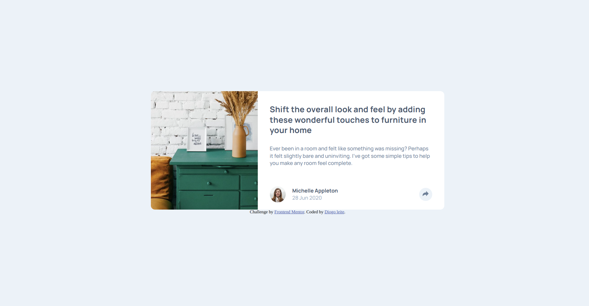

# Frontend Mentor - Article preview component solution

This is a solution to the [Article preview component challenge on Frontend Mentor](https://www.frontendmentor.io/challenges/article-preview-component-dYBN_pYFT). Frontend Mentor challenges help you improve your coding skills by building realistic projects. 

## Table of contents

- [Overview](#overview)
  - [The challenge](#the-challenge)
  - [Screenshot](#screenshot)
  - [Links](#links)
- [My process](#my-process)
  - [Built with](#built-with)
- [Author](#author)

## Overview

### The challenge

Users should be able to:

- See hover and focus states for all interactive elements on the page

### Screenshot

## Desktop

## Tablet

## Mobile

### Links

- Live Site URL: [Link](https://09-article-preview-component.vercel.app/)

## My process

### Built with

- Semantic HTML5 markup
- CSS custom properties
- Sass
- Css Grid
- Flexbox
- Vanilla javascript
- Mobile-first workflow

## Author

- Frontend Mentor - [@diogojustino](https://www.frontendmentor.io/profile/diogojustino)
- Linkedin - [Diogo leite](https://www.linkedin.com/in/diogo-leite-/)
